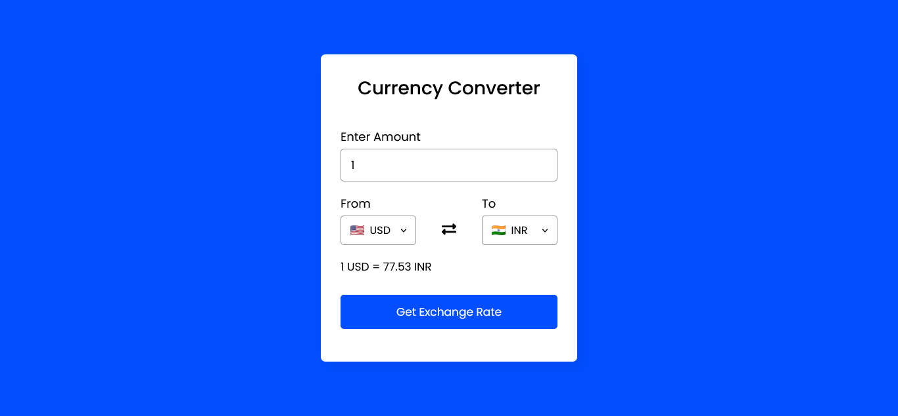

# Currency Converter


Currency Converter website is used to convert currency rates between 161 currencies. It was created using HTML5, CSS3, JavaScript and Exchange Rate API.

## Installation

**STEP 1 :** Clone the repository using `git`
```bash
git clone https://github.com/Prakashdeveloper03/Currency-Converter.git
```

**STEP 2 :** Visit the [ExchangeRate-API](https://www.exchangerate-api.com/) website and get your free API key.

**STEP 3 :** Change to the `js` folder
```
cd Currency-Converter-main/assets/js
```

**STEP 4 :** Create a new javascript file named `config.js` and insert the below lines
```js
let config = {
  API_KEY: "YOUR_KEY"
};
```

**STEP 5 :** Replace the "YOUR_API_KEY" with your actual api key

## 📷 Screenshots

